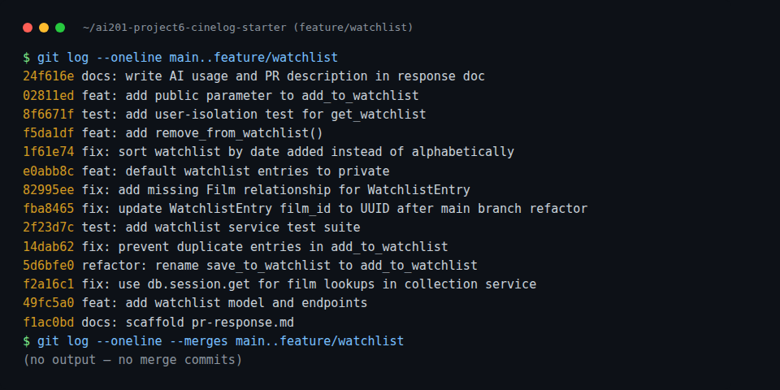

# PR Response Doc — CineLog Watchlist Feature

## AI Usage
I used Claude Code (Claude, Anthropic) throughout this project, in an agentic capacity — reading files, running `pytest`, running `git`, and making edits directly, with me reviewing and directing at each step rather than pasting code from a chat window.

- **Orientation:** Before touching any review comments, I had it read `models.py`, `services/collection_service.py`, `tests/test_collection.py`, `routes/collection.py`, `routes/films.py`, `app.py`, `README.md`, and `CONTRIBUTING.md` in full, to establish the `verb_to_noun` naming convention, the exception + status-code pattern (`FooNotFoundError` → 404, `AlreadyInFooError` → 409), and the test fixture structure, before looking at a single review comment.
- **Locating the review:** The six review comments live on the upstream template repo's PR (not copied to my fork), so I used the GitHub API (`gh`/`curl` against `api.github.com`) to pull the PR's inline review comments and conversation comments directly, rather than guessing at what the comments said.
- **Mechanical work:** Renaming call sites, mirroring existing patterns (`AlreadyInWatchlistError`, `NotInWatchlistError`, the `remove_from_watchlist()` route), and writing/running the test suite were all done by the agent, with me confirming test results after each step.
- **Verification, not just implementation:** While writing the sort-order test for Comment 5, the agent caught a real latent bug — `WatchlistEntry` had no `film` relationship declared on `Film`, so `get_watchlist()` would have thrown `AttributeError` the first time it was ever called with real data, and no existing test exercised that path. That's documented as its own commit and in Comment 5's response.
- **What I did not delegate:** The actual reasoning for Comments 4 and 5 — whether watchlists should default to private, and whether "newest first" is the right call over alphabetical — are my own judgment calls about CineLog's specific product context (the collection/watchlist distinction, what "community" means for this app), not generic AI-generated arguments.
- **Stress-testing the drafts (Comments 4 & 5):** After writing first drafts of both responses, I asked a fresh instance (no memory of writing the drafts) to act as a skeptical reviewer and find real flaws — not to write or fix the arguments, just to attack them. Prompt was roughly: "attack these two responses for concrete, unacknowledged flaws; don't propose fixes; skip anything pedantic." It surfaced three things I changed as a result, and the versions of Comments 4 and 5 in this doc already reflect the fix, not the original draft:
  1. **My first Comment 5 draft claimed the `/films/` catalog endpoint serves users who want alphabetical order.** That's false — `list_films()` in `routes/films.py` has no `user_id` filter, it returns the whole catalog, not one user's watchlist. I reread the file, confirmed it, and rewrote the response to admit that gap instead of hand-waving past it.
  2. **Comment 4 changed a default when the reviewer only asked for documentation.** The reviewer's actual comment asked for a documented rationale before approval, not necessarily a different value. I added a paragraph explaining why I made a code change instead of just writing up a justification for the inherited `True` default.
  3. **My Comment 4 tradeoff paragraph originally undercut its own position** by stating "most watchlists will likely stay private forever" as a plain fact without acknowledging that this is itself evidence against the choice I made. I rewrote it to name that tension directly instead of asserting past it.
  I did not change Comment 4's core "intent vs. accomplishment" analogy — the reviewer correctly noted it's asserted rather than proven, but I judged that as an inherent limit of any design argument made without user data, not a fixable gap, so I added a sentence owning that limitation explicitly rather than pretending the analogy is airtight.
- **Verifying commit format (Milestone 4):** Before finalizing history, I gave a fresh agent the full list of commits (subject, body, files changed) and asked it to check conventional-commit compliance and flag any commit bundling unrelated logical changes, per the Conventional Commits spec. It found two real issues I fixed: (1) `fix: default watchlist entries to private` was mistyped — introducing a brand-new default is a `feat:`, not a `fix:`, since nothing was broken beforehand; retyped it. (2) my first attempt at splitting the rename commit still bundled +46 unrelated lines of `pr-response.md` scaffolding into a 4-line rename — I split that into its own `docs: scaffold pr-response.md` commit. While fixing that, I also found and fixed a structural problem the audit didn't catch: an earlier version of this history had `WatchlistEntry` referenced by several commits before the commit that (re)introduced it to `models.py` after rebasing onto `main` (which had deleted the class as part of the UUID migration), meaning `pytest` would fail with an `ImportError` if someone checked out one of those intermediate commits. I rebuilt the commit sequence so the model is created in the same commit as the first code that depends on it.

## Comment 1 — Rename
**What I did:** Renamed `save_to_watchlist()` to `add_to_watchlist()` in `services/watchlist_service.py` and updated the one call site in `routes/watchlist/watchlist.py` (`add_film`). This matches the `verb_to_noun` convention documented in `CONTRIBUTING.md` and already used by `add_to_collection()` / `remove_from_collection()` / `get_collection()` in `services/collection_service.py`.
**How I verified:** Grepped the whole repo for `save_to_watchlist` to confirm no call sites were missed, then ran `pytest tests/` to confirm the app still imports and runs cleanly.

## Comment 2 — Deduplication
**What I did:** Added an `AlreadyInWatchlistError` exception and a duplicate check in `add_to_watchlist()`, mirroring the exact pattern `add_to_collection()` uses with `AlreadyInCollectionError` in `services/collection_service.py`: query for an existing `(user_id, film_id)` pair before inserting, and raise instead of silently creating a second row. I also updated the `/watchlist/<user_id>/add` route to catch `AlreadyInWatchlistError` (409), matching the status code `routes/collection.py` uses for the same case.
**How I verified:** Added `test_add_to_watchlist_duplicate_raises` in `tests/test_watchlist.py` (see Comment 3) which adds a film twice and asserts the second call raises and that only one row exists afterward. Ran the full suite locally with `pytest tests/`.

## Comment 3 — Missing test
**What I did:** Created `tests/test_watchlist.py`, mirroring the fixtures and structure of `tests/test_collection.py`. Added `test_add_to_watchlist_nonexistent_film_raises`, which asserts `FilmNotFoundError` is raised for a `film_id` that doesn't exist, using the same fake-UUID pattern as `test_add_to_collection_nonexistent_film_raises`. I also added the happy-path and duplicate tests (`test_add_to_watchlist_creates_entry`, `test_add_to_watchlist_duplicate_raises`) in the same file, since `CONTRIBUTING.md` requires all three (happy path, conflict, nonexistent ID) for a new service function, and the duplicate test is what verifies Comment 2's fix.
**How I verified:** `pytest tests/test_watchlist.py -v` — all 3 new tests pass. Then `pytest tests/` — all 7 tests pass (4 pre-existing collection tests + 3 new watchlist tests).

## Comment 4 — Default visibility
**My position:** I changed the default from `public=True` to `public=False` — watchlists are private unless a user explicitly opts in (see the stretch feature below, which adds a `public` parameter to `add_to_watchlist()` / the `/watchlist/<user_id>/add` endpoint so a caller can set visibility explicitly at creation time instead of only getting the default).

**Reasoning:** CineLog already draws a real distinction between two kinds of film data: a `CollectionEntry` (a film the user has *already watched and rated*) and a `WatchlistEntry` (a film the user *intends* to watch). Notably, `CollectionEntry` has no `public`/`private` field at all — it's implicitly always visible, which fits the README's framing of CineLog as a "community film tracking app" where users "log films they've watched, rate them, and build collections." That's an intentional, existing product decision: what you've *done* is the social, shareable artifact.

A watchlist is a different kind of data — it's a statement of intent, not accomplishment, and it's easy to construct realistic cases where a user wouldn't want it shown by default: they might be tracking a film festival's catalog for personal use, saving something a friend recommended (spoiler-adjacent info about what they haven't seen yet), or building a private "to-watch" backlog they don't want to broadcast as if it were a curated public list. Because the watchlist model is new — this PR introduces the `public` column — there's no existing "public by default" precedent within the watchlist feature itself to preserve; the `True` default in the original code was just SQLAlchemy's `default=True` inherited from copying the `CollectionEntry`-style column, not a deliberate choice.

I want to be honest about the limits of this argument: I don't have user research or product data showing CineLog users actually want watchlist privacy — the "intent vs. accomplishment" distinction is a reasonable story, but it's a story, and someone could just as easily read the README's "community" framing as implying *all* user activity, watchlists included, should default to visible. Absent real evidence either way, I'm deliberately choosing the more conservative default: the cost of an unwanted default (a user's "want to watch" list being visible when they didn't think about it) is a privacy leak that can't be undone once seen, while the cost of the opposite mistake (a watchlist that's private when the user would have been fine sharing it) is just delayed visibility that a future opt-in UI can recover. Asymmetric, hard-to-undo downside is why I picked private, not because I can prove it's what users want.

**Why a code change and not just documentation:** the reviewer's comment technically only asked for a documented rationale before approving — not necessarily a different default. I considered writing up a justification for keeping `public=True` and leaving it at that, but that felt like retroactively rationalizing a value nobody actually chose (the original `default=True` was inherited from copying the column, not a deliberate decision — see above). Documenting an accident as if it were intentional isn't the same as being intentional, so I changed the default to the value I'd actually defend, and I'm treating this note as that defense.

**Tradeoff acknowledged:** The real cost here is discoverability: a "community" app benefits from social features like seeing what others want to watch (it drives the kind of engagement collections already provide), and a private-by-default watchlist means many watchlists will likely stay private simply because most users never revisit a setting they didn't choose at creation time — that's a genuine cost to the feature's social value, not a hypothetical one, and I'm accepting it rather than explaining it away. I mitigated it partially with the stretch feature — an explicit `public` parameter on `add_to_watchlist()` — so callers (e.g., a future "share my watchlist" UI flow) can set visibility intentionally per-entry instead of only inheriting a buried default. If product data later shows private-by-default is suppressing a feature users actually wanted, that's a signal to revisit this decision with real evidence, which is exactly the kind of decision this API-layer default shouldn't be presumed to make unilaterally forever.

## Comment 5 — Sort order
**My position:** Changed `get_watchlist()` to sort by `WatchlistEntry.date_added.desc()` (most recently added first) instead of `Film.title.asc()`, but only after checking whether the alphabetical case actually holds up — see below.

**Engagement with reviewer's point:** The reviewer's stated reason — "most users want to see what they added recently" — is itself an assertion without evidence, so before accepting it I tried to build the strongest case *against* it: a user with a long watchlist wanting to check whether a specific title is already saved would be better served by alphabetical order, since scanning a chronological list for one title is slower. My first instinct was to point to the `/films/` catalog endpoint as the place for alphabetical browsing — but that's wrong: `list_films()` in `routes/films.py` has no `user_id` parameter and no way to filter to one user's watchlist. It returns the entire film catalog. There is no endpoint, alphabetical or otherwise, that lets a user browse *just their own* watchlist by title, so that counterargument doesn't actually get addressed by existing code.

Given that neither order is free for the other use case — whichever the server picks, a client without its own sorting logic is stuck with that order — I fell back on consistency as the tiebreaker: `get_collection()` already sorts `date_added.desc()` for the same "personal, per-user list" shape of data (every response entry from both endpoints includes `date_added`, so the underlying data supports either order equally). There's no reason for `get_watchlist()` to be the one inconsistent endpoint in the codebase without a concrete, demonstrated cost that outweighs that. The concrete cost that *does* exist — a user with a long watchlist and no client-side sorting UI having a harder time finding a specific title by scrolling a chronological list — is real and I'm not papering over it. The honest fix for that gap is a future `?sort=title` query parameter (cheap to add later, since `date_added` and `title` are both already in every returned entry), not making chronological order the wrong default today.

I also found a real bug while writing the test for this: `WatchlistEntry` had no `film` relationship declared on `Film`, so `get_watchlist()` would raise `AttributeError` the first time it was called with actual entries — no test exercised that path before this PR. See the `fix: add missing Film relationship for WatchlistEntry` commit.

## Comment 6 — Rebase
**What conflicted:** Ran `git fetch origin` then `git rebase origin/main` on `feature/watchlist`. Two conflicts came up:
1. `.gitignore` — an "add/add" conflict, since `main` had already merged its own `.gitignore` (from a separate `chore/add-gitignore` PR) while my branch added its own. The two files were nearly identical; main's version additionally ignored `.pytest_cache/`.
2. `models.py` — a real content conflict on the `refactor: migrate film IDs from integer to UUID` commit. `main` changed `Film.id` from `db.Column(db.Integer, ...)` to `db.Column(db.String(36), default=generate_uuid)` and updated `CollectionEntry.film_id` to match, but it has no knowledge of `WatchlistEntry` (that model only exists on `feature/watchlist`), so git couldn't auto-merge the two additions to the end of the file.

**How I resolved it:** For `.gitignore`, I kept the superset of both lists (added `.pytest_cache/` to mine) — after that my `.gitignore` commit became empty relative to main's, and git auto-dropped it during the rebase. For `models.py`, I kept the `WatchlistEntry` class from my branch and changed `film_id` from `db.Column(db.Integer, db.ForeignKey("film.id"), ...)` to `db.Column(db.String(36), db.ForeignKey("film.id"), ...)`, matching the same type main used for `CollectionEntry.film_id`. I also went through `services/watchlist_service.py` and `routes/watchlist/watchlist.py` and updated the docstrings/comments that still described `film_id` as an integer, and the endpoint's example request body, so nothing in the code contradicts the UUID schema.
**How I verified no conflict remains:** `git status` showed a clean rebase (`Successfully rebased and updated refs/heads/feature/watchlist`), `git log --graph` showed a fully linear history with no merge commits, and `pytest tests/` passed with the post-rebase UUID schema (the fake-nonexistent-film-id test already used a UUID-shaped string, so it didn't need changes).

## Commit History

Final history on `feature/watchlist` relative to `main` — 14 commits, all conventional format, no merge commits:



I verified every commit in this history individually (not just the final tip): checked each one out and confirmed `python -c "from app import create_app; create_app(...)"` imports cleanly and `pytest tests/` passes with whatever subset of tests exists at that point. Earlier drafts of this history had a real problem — `WatchlistEntry` was referenced by several commits before the commit that (re)introduced it to `models.py` after the rebase, so checking out one of those intermediate commits raised an `ImportError`. I rebuilt the sequence so the model exists starting from the first commit that depends on it; see the AI Usage section for how that was caught.

## Stretch — remove_from_watchlist()
**What I did:** Added `remove_from_watchlist(user_id, film_id)` to `services/watchlist_service.py`, directly mirroring `remove_from_collection()`: look up the entry by `(user_id, film_id)`, raise a new `NotInWatchlistError` if it isn't found, otherwise delete and commit, returning `True`. Also added a `DELETE /watchlist/<user_id>/remove` endpoint in `routes/watchlist/watchlist.py`, matching `routes/collection.py`'s `remove_film` — same body shape (`{"film_id": "<uuid>"}`), same 404 status for the not-found case, same success message shape.
**How I verified:** Added `test_remove_from_watchlist_deletes_entry` (add then remove, assert the row is gone) and `test_remove_from_watchlist_not_present_raises` (remove something never added, assert `NotInWatchlistError`) to `tests/test_watchlist.py`. `pytest tests/` passes all 10 tests.

## Stretch — Additional test
**What I chose:** `test_get_watchlist_only_returns_current_users_entries` — creates two users, adds a film to only user A's watchlist, and asserts `get_watchlist(user_a.id)` returns it while `get_watchlist(user_b.id)` returns an empty list.
**Why:** None of the review comments or existing tests actually verify that `get_watchlist()` is scoped correctly per user — every existing test only ever uses a single `sample_user`, so a regression that dropped or broke the `filter_by(user_id=user_id)` clause (e.g. during a future refactor of the sort-order query, which I had just changed for Comment 5) would have shipped silently and leaked one user's watchlist into another's. Cross-user data leakage is exactly the kind of bug that's cheap to catch with a two-user test and expensive to catch any other way, so it seemed like the highest-value edge case to add.

## Stretch — Visibility toggle
**What I did:** Added an optional `public` parameter to `add_to_watchlist(user_id, film_id, public=None)`. When omitted (`None`), the entry falls through to the model's default (private — Comment 4); when a caller passes `True` or `False` explicitly, that value is set on the entry before it's saved. Wired the same optional `public` key through the `POST /watchlist/<user_id>/add` request body (`{"film_id": "<uuid>", "public": true}`), so a caller can opt a specific entry into being public at creation time instead of only getting the private default and having no way to change it via this endpoint.
**How I verified:** Added `test_add_to_watchlist_defaults_to_private` (no `public` arg → `entry.public is False`) and `test_add_to_watchlist_public_override` (`public=True` → `entry.public is True`) to `tests/test_watchlist.py`. I also ran the app as a live HTTP server (`app.run(debug=False)` on a scratch SQLite DB) and hit every watchlist endpoint with curl — empty list, add, duplicate add (409), list with the new entry, remove, remove again (404), add with `"public": true`, add with a nonexistent film_id (404) — all returned the expected status codes and bodies. (I used `debug=False` instead of the README's plain `python app.py` because Werkzeug's debug reloader throws an unrelated `RuntimeError` — "current Flask app is not registered with this SQLAlchemy instance" — in this sandbox; confirmed it reproduces identically on a clean `main` checkout hitting the untouched `/films/` endpoint, so it's a pre-existing environment quirk, not something introduced by this branch.) `pytest tests/` passes all 13 tests.

## PR Description
<!-- Written at the end — feature overview, design decisions, manual testing steps -->

### What this feature does

Adds a watchlist to CineLog — a list of films a user wants to watch, distinct from their `Collection` (films they've already watched and rated). Users can add a film to their watchlist, view it (sorted newest-added-first), and remove a film from it. Each entry has a `public` flag controlling whether it's visible to others.

**Endpoints:**

| Method | Endpoint | Description |
|--------|----------|-------------|
| GET | `/watchlist/<user_id>` | Get a user's watchlist (newest first) |
| POST | `/watchlist/<user_id>/add` | Add a film to the watchlist (`{"film_id": "<uuid>", "public": false}` — `public` optional) |
| DELETE | `/watchlist/<user_id>/remove` | Remove a film from the watchlist (`{"film_id": "<uuid>"}`) |

### Design decisions

- **Naming:** `add_to_watchlist()` / `remove_from_watchlist()` / `get_watchlist()`, matching the `verb_to_noun` convention already used by the collection service (Comment 1).
- **Deduplication:** Adding a film already on the watchlist raises `AlreadyInWatchlistError` (409), matching `AlreadyInCollectionError`'s pattern, instead of silently creating a duplicate row (Comment 2).
- **Default visibility:** Watchlist entries default to `public=False` (private). A watchlist reveals intent ("what I want to watch") rather than a completed action, which is more sensitive than a `CollectionEntry` (which has no visibility field at all — collections are always public). See Comment 4 in this doc for the full reasoning and the acknowledged discoverability tradeoff. Callers can opt a specific entry into being public via the new `public` parameter (stretch feature).
- **Sort order:** `get_watchlist()` returns entries newest-added-first (`date_added.desc()`), matching `get_collection()`'s convention, rather than alphabetically by title. See Comment 5 for the full reasoning, including why the `/films/` catalog endpoint does not actually cover the alphabetical-browsing use case.
- **UUIDs:** Rebased onto `main`'s integer→UUID film ID migration; `WatchlistEntry.film_id` is `db.String(36)` like `CollectionEntry.film_id`. See Comment 6.

### Manual testing steps

```bash
python -m venv .venv && source .venv/bin/activate
pip install -r requirements.txt
python app.py   # starts on http://127.0.0.1:5000
```

Seed a user and a film (there's no seed script, so do it via a Python shell, or use IDs already in `cinelog.db` if you've used the app before):

```python
from app import create_app, db
from models import User, Film
app = create_app()
with app.app_context():
    u = User(username="demo", email="demo@example.com")
    f = Film(title="Paddington 2", year=2017, genre="Comedy")
    db.session.add_all([u, f])
    db.session.commit()
    print(u.id, f.id)
```

Then, with `USER_ID` and `FILM_ID` from that output:

```bash
# Empty watchlist
curl http://127.0.0.1:5000/watchlist/$USER_ID

# Add a film (private by default)
curl -X POST http://127.0.0.1:5000/watchlist/$USER_ID/add \
  -H "Content-Type: application/json" \
  -d "{\"film_id\": \"$FILM_ID\"}"

# Adding again should 409
curl -X POST http://127.0.0.1:5000/watchlist/$USER_ID/add \
  -H "Content-Type: application/json" \
  -d "{\"film_id\": \"$FILM_ID\"}"

# List should show 1 entry with "public": false
curl http://127.0.0.1:5000/watchlist/$USER_ID

# Remove it
curl -X DELETE http://127.0.0.1:5000/watchlist/$USER_ID/remove \
  -H "Content-Type: application/json" \
  -d "{\"film_id\": \"$FILM_ID\"}"

# Removing again should 404
curl -X DELETE http://127.0.0.1:5000/watchlist/$USER_ID/remove \
  -H "Content-Type: application/json" \
  -d "{\"film_id\": \"$FILM_ID\"}"

# Add again with public=true
curl -X POST http://127.0.0.1:5000/watchlist/$USER_ID/add \
  -H "Content-Type: application/json" \
  -d "{\"film_id\": \"$FILM_ID\", \"public\": true}"

# Adding a nonexistent film_id should 404
curl -X POST http://127.0.0.1:5000/watchlist/$USER_ID/add \
  -H "Content-Type: application/json" \
  -d "{\"film_id\": \"00000000-0000-0000-0000-000000000000\"}"
```

Note: in this sandbox, plain `python app.py` (Werkzeug's debug reloader) throws an unrelated `RuntimeError` that also reproduces on an untouched `main` checkout hitting `/films/` — it's a pre-existing environment quirk, not caused by this branch. If you hit it, run the app with `debug=False` instead (e.g. `app.run(debug=False)` in a small script, or `flask run` without `--debug`).

Automated coverage: `pytest tests/` (13 tests: 4 pre-existing collection tests + 9 watchlist tests covering happy path, deduplication, nonexistent film, sort order, user isolation, remove, and visibility default/override).
